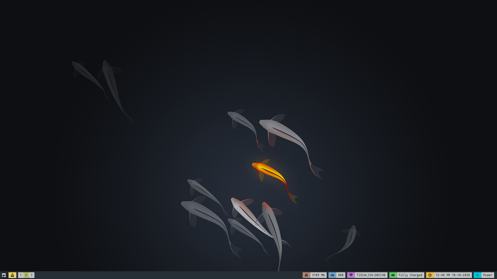

# My Polibar Theme Setup

```

```

https://github.com/adi1090x/polybar-themes) repository.

The theme is the polybar-8, I just tweaked it to work on my current setup.

PS: The wallpaper is not mine.

## Installation

Copy the folder on ~/.config/polybar

## Usage

```bash
./launch.sh
```